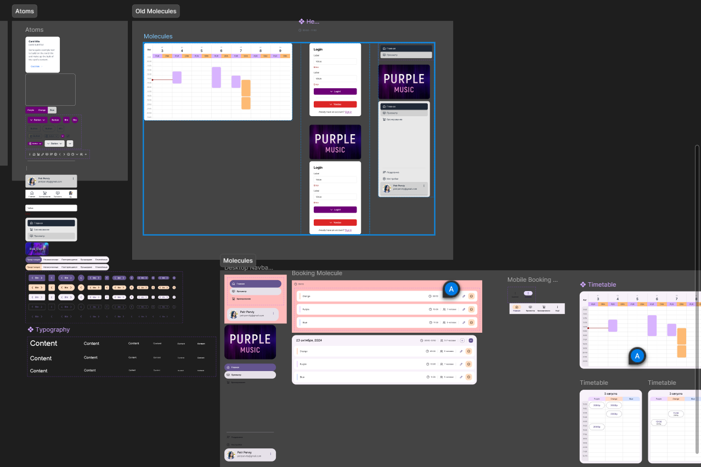

# Purple Music – Frontend 🎧

**Next.js frontend for the Purple Music studio booking platform**

This is the frontend application for **Purple Music**, a SaaS platform designed to manage real-world music studio
bookings. It features a custom UI, multi-method authentication, and seamless integration with both a NestJS backend and
a Telegram Mini App.

---

## 🛠️ Tech Stack

- **Framework**: Next.js 15 (App Router) with TS
- **State/Data**: React Query + Axios
- **UI**: Tailwind CSS + React Aria
- **Auth**: JWT (cookies) – supports multiple providers
- **Design**: Built from my own Figma mockups
- **I18n**: i18next + react-i18next
- **Other tools**:
    - Storybook (currently broken, WIP)
    - ESLint + Prettier



---

## 🎨 UI Overview

This app is custom-built — no component libraries (except Tailwind, React Aria). I designed and built the core UI
myself, focusing on
accessibility and simplicity. It includes:

- **Dashboard** – high-level view for users to manage bookings
- **Calendar** – visual schedule of studio availability
- **Booking** – create and manage studio sessions
- **Auth screens** – login, registration, reset password, verify email


---

## 🔐 Authentication

- JWT stored in HTTP-only cookies
- Works with:
    - Email/password (bcrypt)
    - Telegram
    - Yandex
- Tokens issued/verified via the backend

---

## 📦 Project Structure (simplified)

```bash
/src
├── components        # Custom UI components (layout, shared, ui)
├── features          # Feature-sliced components
├── app               # New routes using App Router with i18n in mind
├── hooks             # Custom React hooks
├── i18n + locales    # Config and translations
├── api               # Axios + React Query custom hooks
├── lib               # Utility functions (middleware, axios, etc.)
├── stories           # Storybook-related files
```

---

## 🚀 Getting Started

Use [infra repo](https://github.com/purple-music/infra) to build and run the app locally!

Requires:

- Environment variable NEXT_PUBLIC_BACKEND_URL

---

## 📋 Known Issues / TODOs

- [ ] Fix Storybook build
- [ ] Telegram Auth outside Mini App
- [ ] Integrate React Aria into basic components

---

## 🤝 Integration Points

- **Backend**: NestJS API for auth, bookings, and user management
- **Telegram**: WebApp integration for smooth Mini App login

---

## 🧑‍💻 Author

Built and maintained by @KhoDis. This frontend is part of a fullstack project developed to support a real music
studio.
